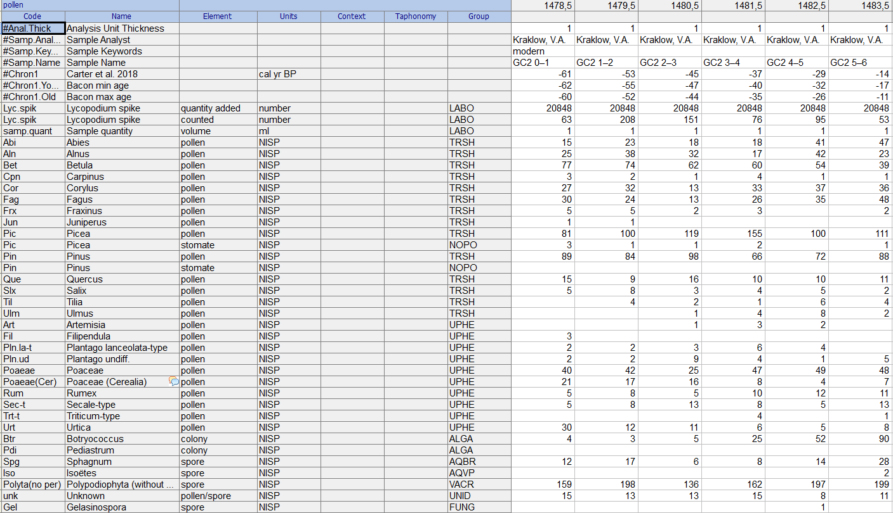

# 1. Workshop overview and objectives

This workshop is designed to provide participants at the PalaeOpen Training School (Sofia, 15–19 June 2026) with an overview of the `neotoma2` R package and its use in obtaining and analysing data from the Neotoma Paleoecology Database.

The workshop combines short conceptual explanations with guided coding exercises using R. We will be using:

-   **Prášilské Lake** `Neotoma site ID 26991` [link](https://apps.neotomadb.org/explorer/?siteids=26991)
-   Available datasets for the site: **Pollen**, **diatoms**, **chironomids** & **charcoal**

## Learning Objectives

1.  Understand the basic data structure within the `neotoma2` R package
2.  Search for sites using site names and geographical coordinates
3.  Filter results using temporal and spatial parameters
4.  Obtain sample data for selected datasets
5.  Extract and inspect pollen datasets from the Neotoma Paleoecology Database
6.  Perform basic exploratory analysis and visualization of pollen data
7.  Build reproducible workflows using Quarto

## Online resources

1.  [Code repository for the workshop](https://github.com/PalaeOpen/workshop-neotoma2-trainingschool)
2.  [Neotoma Palaeoecology Database Manual](https://open.neotomadb.org/manual/)
3.  [neotoma2 GitHub Repository](https://github.com/neotomadb/neotoma2 (including previous Neotoma workshop repositories)
4.  [PalaeOpen R Zulip channel](https://palaeopen.zulipchat.com/#narrow/channel/540741-it_r)
5.  [Neotoma Slack channel](https://neotomadb.slack.com/join/shared_invite/zt-cvsv53ep-wjGeCTkq7IhP6eUNA9NxYQ#/shared-invite/email) 

## Install and load the necessary packages

This workflow relies on different R libraries, including tidyverse, geojsonsf and leaflet, to handle geographic data and interactive mapping. To streamline the setup, we utilize the pacman management tool. If any required package is missing from your local environment, pacman will automatically download and install it before loading.

```{r}
# Clean workspace first
rm(list = ls())
#install.packages("pacman") #install the library
pacman::p_load(neotoma2, tidyverse, ggplot2, rioja)
```

R is highly dependent on the sequence in which libraries are activated. Common function names such as `filter()` exist in multiple packages (e.g., both dplyr and neotoma2). If a naming conflict occurs, R might attempt to apply the wrong function to your data object

To prevent these namespace collisions, it is best practice to explicitly declare the source package using the double-colon operator (for example, `neotoma2::filter()` or `dplyr::filter()`). This ensures R executes the exact command you intend.

# 2. Introduction to neotoma2

The `neotoma2` package provides programmatic access to the Neotoma database through R. The database uses an application programming interface (API), which serves the [online explorer](https://apps.neotomadb.org/explorer/) as well as [Tilia](https://www.neotomadb.org/apps/tilia)

## Key Concepts

-   Sites
-   Datasets
-   Samples
-   Taxa
-   Counts
-   Stratigraphic plots --> more 
-   Chronologies --> Thomas' age-depth modeling workshop (link)

## Neotoma UML diagram {.tabset}

 

# Working with Sites

`sites` are spatial objects in `neotoma2` Sites have names, locations, and are found within the context of geopolitical units, but within the API and the package, the site itself does not have associated information about taxa, dataset types or ages. It is simply the container into which we add that information. So, when we search for sites we can search by:

| Parameter | Description |
| --------- | ----------- |
| sitename | A valid site name (case insensitive) using `%` as a wildcard. |
| siteid | A unique numeric site id from the Neotoma Database |
| loc | A bounding box vector, geoJSON or WKT string. |
| altmin | Lower altitude bound for sites. |
| altmax | Upper altitude bound for site locations. |
| database | The constituent database from which the records are pulled. |
| datasettype | The kind of dataset (see `get_table(datasettypes)`) |
| datasetid | Unique numeric dataset identifier in Neotoma |
| doi | A valid dataset DOI in Neotoma |
| gpid | A unique numeric identifier, or text string identifying a geopolitical unit in Neotoma |
| keywords | Unique sample keywords for records in Neotoma. |
| contacts | A name or numeric id for individuals associuated with sites. |
| taxa | Unique numeric identifiers or taxon names associated with sites. |
| ageyoung | A minimum spanning age for the record, in years before radiocarbon present (1950). |
| ageold | A maximum spanning age for the record, in years before radiocarbon present (1950). |
| ageof | An age which must be contained within the range of sample ages for a site. |

## Option 1 Site location: `loc` {.tabset}
Using a bounding box and search for sites based on the geographical coordinates found in it. For instance we search all sites in Europe. As there are more than 2000 we set `all_data = FALSE`:

```{r}
europe <- list(geoJSON = '{"type": "Polygon",
        "coordinates": [[
            [-30, 30],
            [70, 30],
            [70, 90],
            [-30, 90],
            [-30, 30]]]}')

eu_sites <- get_sites(loc = europe$geoJSON, all_data = FALSE) #if all_data = TRUE all available records will be queried. with all_data = FALSE, only the first 25 sites will be queried
neotoma2::summary(eu_sites) 
```

Now we plot the resulting spatial object of the sites with the built-in `plotLeaflet` neotoma2 function.

```{r}
neotoma2::plotLeaflet(eu_sites) 
```

We can also be more restrictive and add extra arguments in `get_sites()` and look for pollen datasets and certain site names if we know what site we are looking for, or if we only know part of the name e.g. that is called lake in Bulgarian: ezero. 

```{r}
ezero_pollen <- get_sites(datasettype="pollen", loc=europe$geoJSON, sitename = "%ezero%") #Note that % is a wildcard character
neotoma2::plotLeaflet(ezero_pollen) 

```

## Option 2 Site location: `gpid` {.tabset}
Using a geopolitical unit to search sites in e.g.,  **Bulgaria**

```{r}
bulgaria_sites <- get_sites(gpid=c("Bulgaria"))
neotoma2::plotLeaflet(bulgaria_sites) 

neotoma2::summary(bulgaria_sites)
```

# Working with datasets

A `sites` object contains `collectionunits` which contain `datasets`. From the table above we can see that some of the sites we have looked at contain different `dataset` types. We can also see that for each site, different `collectionunits` (i.e., usually cores) can be found. 

Having a `sites` object we can directly call `get_datasets()` to pull in more metadata about the datasets. At any time we can use `datasets()` to get more information about any datasets that a sites object may contain. Below we compare the output of `datasets(bulgaria_sites)` to the output of a similar call using the following:

```{r}
datasets(bulgaria_sites)
bulgaria_datasets <- get_datasets(bulgaria_sites)
```

# Filtering records
It is sometimes recommended to do some filtering before we download the samples contained in the `dataset` or `site` objects.

If we choose to pull in information about only a single dataset type, or if there is additional filtering we want to do before we download the data, we can use the filter() function. For example, if we only want pollen records from all bulgarian datasets, and want records with known chronologies, we can filter:

```{r}
bulg_pollen <- bulgaria_sites %>%
  neotoma2::get_datasets() %>%
  neotoma2::filter(datasettype == "pollen" & !is.na(age_range_young))

neotoma2::summary(bulg_pollen)
```

## Excercise #1
Think about any other filtering criteria you want to apply to search for sites in Neotoma.
**Hint**: You can type `?neotoma2::get_sites()` and the helper function will open in your RStudio with the available search parameters.

Work individually for about 15 minutes and then share with your peer next to you what you have found.

# Working with samples

Up until now we have seen how to: 
1.    Search for sites applying different criteria,
2.    Plot where the site(s) are located and,
3.    Obtain the `collectionunits` and `datasets` that a `site` object contain.

Functions like `get_sites()` or `get_datasets()` only pull down high-level metadata (site names, geographic coordinates, dataset IDs, etc) to keep things fast and avoid large files quering the API.
To populate that object with the detailed data—like analysis units, sample depth, chronologies, and taxon counts, we need to pass it into the `get_downloads()` function.

For that, we will use the site **Prášilské jezero**, a mountain lake located in Czechia (Šumava Mts.). This site has been analyzed for several proxies, including pollen, diatoms, chironomids and charcoal.

```{r}
pra_data <- neotoma2::get_sites(sitename = "Prášilské jezero") %>%
  neotoma2::get_datasets() %>% 
  neotoma2::get_downloads()

pra_data # returns the site information
datasets(pra_data) # provides an overview of the datasets available for that site

```

The function `cite_data()` pulls bibliographic information from the metadata included in the site object. For Prášilské Lake object which include pollen, diatoms, chironomids, and charcoal it will return a list of individual formatted citations and DOIs (Digital Object Identifiers) for each unique dataset so you can credit all the data contributors properly.

```{r}
#neotoma2::cite_data(pra_data)
```

In case the Neotoma API doesn't work, we have already downloaded and saved the site data
```{r}
## The line is commented because there is no need for you to run it
## saveRDS(pra_data, "data/PRA_download.RDS")
```

For the downloaded site we now have information about all the collection units, the datasets, and, for each dataset, all the samples associated with the datasets. To extract all the samples we need to run the funcion `samples()`

```{r}
#pra_data <- readRDS("data/PRA_download.RDS") #uncomment if you need to read in the downloaded object 
pra_samples <- samples(pra_data)
names(pra_samples)
```

The resulting `data.frame` has 13735 rows and 38 variables. The reason is because the table is in **long** format. The opposite format is **wide** format, with sites/samples as rows, and taxa as columns. For certain community analysis this is the suggested format. But for now we continue with the **long** format.

We can also check how many `collectionunits` and `datasettypes` the site has by calling:
```{r}
unique(pra_samples$collunitid)
unique(pra_samples$datasettype)
```
The `collectionunits` are the different cores that were taken and each can have several `datasettypes`.
For some dataset types, or types of analyses some of columns stored in `samples()` may not be needed, however, for other dataset types they may be critically important. The neotoma2 package includes as many column names as possible to cover a wide range of community/ proxy needs.

If you want to know what taxa we have in the record, you can use the function `taxa()` on the downloaded site object. This is basically the samples table with information about how many samples the taxon occurs, in how many sites (in this case only one). The `taxonid` values can be linked to the `taxonid` column in the `samples()`. This allows us to build taxon harmonization tables. But again, this is not the focus of this introductory part.

```{r}
pra_taxa <- neotoma2::taxa(pra_data)
```

# Working with counts
In many Neotoma datasets there exist samples that include different elements for the same taxon. For instance, in pollen datasets, it is common to find `element=pollen` and `element=stomate` for Pine. If we filter the taxa by `element=="pollen"` we might miss all the spores including *ferns* and *mosses*


Another classifier of the taxon list in Neotoma is the `ecologicalgroup`. In Tilia this is shown in the column *Group*. The function `get_table()` can be used to pull existing table names in Neotoma. For instance: `neotoma2::get_table("ecolgroups")`

We now get the pollen counts from the **Prášilské jezero**. We first check which `ecologicalgroup` are found in the pollen dataset:

```{r}
pra_samples %>%
  filter(datasettype=="pollen") %>%
  pull(ecologicalgroup) %>% unique()
```
We are interested in pollen and spores, including ferns and mosses. So we filter pollen samples first by `ecologicalgroup == c("TRSH", "UPHE", "VACR")`

| Code | Ecological group 
| --------- | ----------- 
| TRSH | Trees and Shrubs 
| UPHE | Upland herbs 
| VACR | Vascular cryptograms

These group codes allow us to ignore things that might skew our pollen sums—like algae (AQUA) or fungal spores (FUNG); 
some pollen samples can also include dinoflagellate cysts (DINO). This way we focus on these groups to exclude certain taxa that do no represent the terrestrial vegetation in the final pollen sum.

First we filter by `ecologicalgroup` and `elementtype` to get the counts:
```{r}
pra_pollen_counts <- pra_samples %>%
  dplyr::filter(ecologicalgroup %in% c("TRSH", "UPHE", "VACR")) %>%
  dplyr::filter(elementtype %in% c("pollen", "spore")) %>%
  dplyr::filter(units == "NISP") 
```

Then we calculate the pollen proportions for each taxon and arrange the table by increasing age
```{r}
pra_pollen_prop <- pra_pollen_counts %>%
  dplyr::group_by(depth, age) %>%
  dplyr::mutate(pollen_count = sum(value, na.rm = TRUE)) %>%
  dplyr::group_by(variablename) %>% 
  dplyr::mutate(prop = value / pollen_count) %>% 
  dplyr::arrange(age) %>% #arrange table by increasing age
  dplyr::select(depth, age, variablename, prop, ecologicalgroup) %>% 
  dplyr::mutate(prop = as.numeric(prop)) 

```

## Excercise #2

-   Using the `pra_samples` dataset, calculate the relative proportions of aquatic pollen taxa relative to all the entire sample counts (i.e., terrestrial). 

We reconvene here the long vs wide format. It is useful to pivot the data to a “wide” table for use in other packages such as `vegan` or `cluster` to perform multivariate ordination and classification analyses. Wide format contains variablenames as column headings and we do this for the pollen dataset using `tidyr` of the [tidyverse](https://tidyverse.org) package

```{r}
pra_pollen_wide <- tidyr::pivot_wider(pra_pollen_prop,
                                      id_cols = c(depth, age),
                                      names_from = variablename,
                                      values_from = prop,
                                      values_fill = 0) 
```

Because the pollen matrix contains 91 different taxa, plotting all of them would clutter the stratigraphic diagram. To keep the plot readable, we filter the dataset to include only the most abundant pollen and spore taxa, that is, the top 15 most frequent taxa:

```{r}
pra_plot_taxa <- taxa(pra_data) %>% 
  dplyr::filter(ecologicalgroup %in% c("TRSH", "VACR")) %>%
  dplyr::filter(elementtype %in% c("pollen","spore")) %>%
  dplyr::arrange(desc(samples)) %>% 
  head(n = 15) 
```

# Stratigraphic plot
There exists several packages to perform stratigraphic diagrams of your data. The data needs to be on long or wide format as a funciton of the package used:

| Package | Data structure | function |
| --------- | ----------- | ----------- |
| *ggplot2* | long format | `ggplot()`|
| *tidypaleo* | long format | `Stratiplot()`|
| *analogue* | wide format | `ggplot()`|
| *rioja* | wide format | `strat.plot()`|
| *riojaPlot* | wide format | `riojaPlot()`|

Here we use the `rioja` package and the `strat.plot` function:

```{r}
# subset the most frequent taxa from the pollen wide-format matrix
pra_pollen_freq <- pra_pollen_wide[,-1:-2] %>% 
  select(any_of(pra_plot_taxa$variablename))

rioja::strat.plot(pra_pollen_freq*100, yvar = pra_pollen_wide$age,
                          ylabel = "Calibrated Years BP",
                          xlabel = "Diatom (%)",
                          y.rev = TRUE,
                          wa.order = "topleft", scale.percent = TRUE)

```


